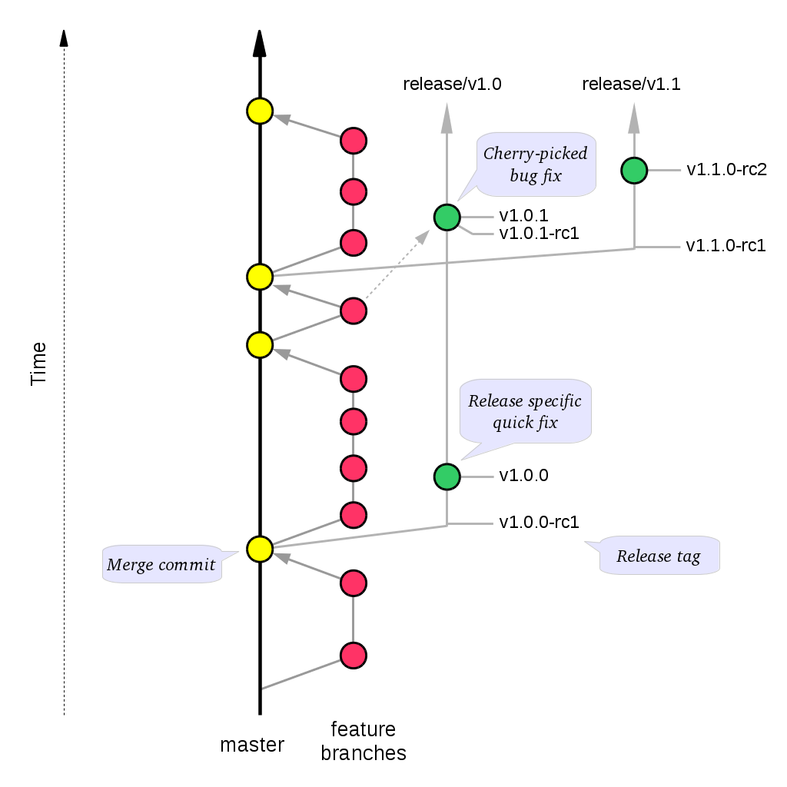

===============
Developer Guide
===============

Introduction
============

This guide, designed for a NLNZ Tools SIP Generation developer and contributor, covers how to develop and contribute to
the NLNZ Tools SIP Generation. The source for both code and documentation can be found at:
https://github.com/NLNZDigitalPreservation/nlnz-tools-sip-generation/

Contents of this document
-------------------------

Following this introduction, the NLNZ Tools SIP Generation includes the following sections:

-   **Contributing** - Covers how to contribute to the project.

-   **Basic packages and classes**  - Covers the packages and classes in the project.

-   **Building** - Covers building the nlnz-tools-sip-generation jars from source.

-   **Developer guidelines** - Covers coding practice and development workflow.

-   **Future milestones** - Covers plans for future development.

Contributing
============

This describes how to contribute to the NLNZ Tools SIP Generation project.

Source Code Repository
----------------------

Source code for the NLNZ Tools SIP Generation is stored in github at:
https://github.com/NLNZDigitalPreservation/nlnz-tools-sip-generation/
Contributors to the codebase will require a github account.

Issue tracking
--------------

Issues are tracked via Github's issue tracking. The current set of issues can be viewed on the project's *Issues* tab.

When creating issues please include as much information as possible. The more information that you include, the easier
it is for the issue resolver to solve the problem. Useful information includes the following:

Background information
~~~~~~~~~~~~~~~~~~~~~~

-   The jar and version of the NLNZ Tools SIP Generation you are using

-   The Java type and version (for example OpenJDK 8u192)

Specific issue information
~~~~~~~~~~~~~~~~~~~~~~~~~~

-   Mention precisely what went wrong, including the steps you took to get to point where things didn't work as
    expected. Describing the steps you took can help us reproduce the issue.

-   Describe what you expected to have happen.

-   Include any relevant log messages.

Pull requests
-------------

Pull requests are managed with Github's pull request process. For pull requests, see the *Pull requests* tab in the
Github project.

License
-------

All contributions to the NLNZ Tools SIP Generation must be under the MIT (2019) License, which can be found at:
https://mit-license.org/

Copyright
---------

In general copyright is assumed to belong to either the person who committed a change or the institution employing that
person.

*Please do not put copyright notices in files.*

Major Contributors
------------------

Major contributors to NLNZ Tools SIP Generation are NLNZ (The National Library of New Zealand)
(https://natlib.govt.nz/). This institution currently drive most development. All contributors are welcome. Making your
interest in NLNZ Tools SIP Generation known can help to ensure that the tools meets your needs.

Development discussion
----------------------

Currently there are no Slack channels are used to discuss current development, but that may come in the future.

Getting help
------------

If the documentation isn't sufficiently clear, please:
TODO where someone can get help
You can also create github issues for specific problems with the code or its documentation.

Basic packages and classes
==========================

TODO a diagram illustrates the interactions between key classes.

Building
========

Requirements
------------

Build requirements
~~~~~~~~~~~~~~~~~~
Building the NLNZ Tools SIP Generation from source requires the following:

-   Java 11 JDK or above (64bit recommended). Current development assumes the use of OpenJDK.

-   Gradle 5.2.1 or later.

-   Groovy 2.5.4 or later.

-   Git (required to clone the project source from Github).

-   Access to maven central either directly or through a proxy.

As the artifact targets are Java-based, it should be possible to build the artifacts on either Linux, Solaris or Windows
targets.

Development platforms
~~~~~~~~~~~~~~~~~~~~~
The following platforms have been used during the development of the NLNZ Tools Sip Generation:

-  Ubuntu GNU/Linux 18.04 LTS and later

Installation
------------
The artifacts are built using gradle and will deploy to a maven repository when various gradle publishing options are
used.

Build commands
--------------

Generate API reference::

    gradle javadoc

Building with unit tests
~~~~~~~~~~~~~~~~~~~~~~~~
Unit tests are normally run as part of a build. To explicitly run unit tests::

    gradle [clean] test

Building with unit tests and publishing artifact
~~~~~~~~~~~~~~~~~~~~~~~~~~~~~~~~~~~~~~~~~~~~~~~~
This can be run from the root project folder::

    gradle [clean] build publishToMavenLocal

Complete build with upgrade-preparation warnings
~~~~~~~~~~~~~~~~~~~~~~~~~~~~~~~~~~~~~~~~~~~~~~~~
When gradle 5.x is released, some gradle features and certain build scripts will not work. In order to prepare for
this eventuality, builds can include the `warning-mode` to notify in advance of changes that will need to happen::

    gradle [clean] build --warning-mode all

Building and skipping unit tests
~~~~~~~~~~~~~~~~~~~~~~~~~~~~~~~~
Generally unit tests should not be skipped::

    gradle [clean] build -x test

Jacoco code coverage
~~~~~~~~~~~~~~~~~~~~
While the jacoco plugin is included in builds, there isn't currently any tasks associated with jacoco.
TODO Add jacoco code coverage tasks.

check
~~~~~
Run both findBugs and PMD source code analyzer::

    gradle check

findBugs
~~~~~~~~
Normally `gradle check` will only run a findBugs report on the main portion of the source code. findBugs can also run on the test code::

    gradle findBugsMain
    gradle findBugsTest

PMD source code analyzer
~~~~~~~~~~~~~~~~~~~~~~~~
Normally `gradle check` will only run a PMD report on the main portion of the source code. PMD can also run on the test code::

    gradle pmdMain
    gradle pmdTest

Developer Guidelines
====================

Coding practice
---------------

-   We assume common good coding practices. Consider following the principles outlined in Robert C. Martin's book
    *Clean Code* (https://www.oreilly.com/library/view/clean-code/9780136083238/ ).

-   New functionality changes have a reasonable set of unit tests included. This can be enforced through minimal code
    coverage tests as part of the build process.

-   Code contains robust instrumentation, which means extensive and detailed logging about the state of operations at
    significant processing points.

Code style
----------

While coding style can be idiosyncratic and personal, consider following established coding styles enforced through
Checkstyle. This ensures that all code has a similar look and feel while also preventing wasted effort in code
reviews and pull requests discussing formatting. Candidates for a consistent coding style include:

-   Google Java Style Guide - https://google.github.io/styleguide/javaguide.html
    which is a subset of the Google style guide https://github.com/google/styleguide

-   OpenJDK Java Style Guide - http://cr.openjdk.java.net/~alundblad/styleguide/index-v6.html

-   Spring framework code style - https://github.com/spring-projects/spring-framework/wiki/Code-Style

-   47deg coding guide - https://github.com/47deg/coding-guidelines/tree/master/java/spring

-   Oracle's coding conventions - https://www.oracle.com/technetwork/java/codeconventions-150003.pdf
    Note that this guide is significantly out of date and is only included here
    for historical purposes.

Definition of Done
------------------

Code is considered done and can be merged into the master branch when the following conditions have been met:

-   The requirements driving the change have been satisfied by the change.

-   The code builds without errors.

-   All unit tests pass.

-   Unit test code coverage remains the same or is increasing.

-   Functional tests have all passed.

-   Non functional requirements met.

-   Significant user journeys all work.

-   Code and other changes have been peer reviewed and approved.

-   New code has instrumentation (logging points) that conveys accurate and
    helpful information about the state of the application.

-   The documentation has been updated to reflect changes in functionality. Some documents that could be updated
    include:
    -   The *Release Notes* `release-notes.rst`, especially for new features.
    -   If there are any changes that would require steps to upgrade from a previous version, update the *Upgrade Guide* `upgrade-guide.rst`.
    -   If there is any helpful advice regarding troubleshooting, update the *Troubleshooting Guide* `troubleshooting-guide.rst`.
    -   If there is helpful information that can be include in the FAQ, update the *FAQ* `faq.rst`.

-   The Product Owner accepts the changes.

Semantic versioning
-------------------

Use semantic versioning as described in https://semver.org/ . This means having a version number composed of major,
minor and patch versions. For current development this means changing the maven `pom.xml` associated with each build
artifact and tagging the associated git commit with the version.

TODO Make the steps to change version number is maven and git more explicit, perhaps as part of the **Git workflow**.

Git Workflow
============

This workflow is a hybrid of several popular git workflows (Github Flow, Atlassian Simple Git, Cactus Model,
Stable Mainline Model), designed to fit the needs of the NLNZ Tools Sip Generation development. It will use a shared
repository model via Github using the https://github.com/NLNZDigitalPreservation/nlnz-tools-sip-generation/
repository.

Commit Messages
---------------

Prefix commit messages with a ticket number (when applicable). This information comes in handy when reviewing git
history, or when cherry-picking individual commits (e.g. when cherry-picking a bug-fix commit from master into a release
branch, the resulting history will be more informative).

TODO Consider more detail in the commit message, limiting line length.

Commit message example
~~~~~~~~~~~~~~~~~~~~~~
::

    D1.1: Add a unit test for dynamic reflow

Master Branch
-------------

The master branch is the default development branch for this project. For most purposes, the master branch is considered
stable. In other words, if you check out the master branch you can expect that:

-   It builds on all supported platforms/targets.

-   All unit tests pass (as well as static tests, linter checks and the like).

-   A “standard run” of dependent software works.

However, the master branch might not pass a comprehensive QA test at all times.

Feature Development
-------------------

Feature branch purpose
~~~~~~~~~~~~~~~~~~~~~~

All development is done in dedicated (relatively short lived) feature branches. This is where most of the action takes
place, including:

-   Feature development.

-   Code review.

-   Integration testing (if any).

A feature branch branches off from master, and once development is finished and all the integration criteria have been
met, code review completed, it is merged back to the master branch using a pull request.

|diagramFeaturesGoingIntoMasterBranch|

Feature branch naming
~~~~~~~~~~~~~~~~~~~~~

This project will use the following convention for naming feature branches:
::

    “feature/<ticket>_description_separated_by_underscores”

where ticket is a reference to the corresponding ticket in the project issue tracker (or work plan), and description is
a very short description (up to five words or so) of the purpose of the branch.

Feature branch naming example:
::

    feature/D1.1_new_harvestagent_h3_impl

If a feature branch is running for an extended period of time, consider breaking the issue/story into smaller components
that can be integrated more frequently with the master branch.

Updating Feature Branches
~~~~~~~~~~~~~~~~~~~~~~~~~

To keep feature branches up to date with changes in the master branch, it is a good idea to rebase regularly from master
to minimize merge conflicts later on when it is time for a feature to be merged back into master.

To update feature branches use merging.

Checking out a branch example:
::

    git checkout feature_branch
    git pull origin master

Reasons for using ‘Always Merge’ convention
~~~~~~~~~~~~~~~~~~~~~~~~~~~~~~~~~~~~~~~~~~~

-   Pull Requests won’t contain rebased commits from master that have already been reviewed. You will just see the
    changes relating to the feature branch.

-   Merging changes from master, ‘rework’ commits, should mean you will only need to fix merge conflicts once. Whereas
    merge conflicts need to be resolved every time a rebase is done.

-   Rebasing can be dangerous when used on shared remote branches, as the history of the branch is being rewritten.

-   No need to worry about using force push for a branch that has been rebased.

-   Rebasing is generally considered a complex and advanced feature of git. In order to make it easier for the community
    to engage with Tools SIP Generation developement, it would be wise to keep the project workflow as simple as
    possible.

Code Review and Pull Requests
-----------------------------

Pull Requests are to be used to initiate code reviews and discussions about the code implementation in a dedicated
branch that does not interfere with the main development branch. This review/testing can done at any stage in the
development of that branch. As a rule, all feature branches must be peer reviewed via Github before being merged into
the master branch.

Sharing a feature branch remotely
~~~~~~~~~~~~~~~~~~~~~~~~~~~~~~~~~

1.  Ensure your feature branch is up to date with latest changes from master.

2.  Push the latest commit from your feature branch to the shared github repository.

3.  Fetch remote feature branch into local repository.

Initiating a code review via Github
~~~~~~~~~~~~~~~~~~~~~~~~~~~~~~~~~~~

1.  Ensure your feature branch is up to date with latest changes from master.

2.  Push the latest commit from your feature branch to the shared github repository.

3.  Navigate to that branch in Github, and open a Pull Request.

4.  Use WIP if not ready to be merged into master.

5.  Use assigning and mentions to ensure the right people are notified of the Pull Request.

After the initial push of a feature branch you can keep pushing updates to the remote branch multiple times throughout.
This can happen in response to feedback, or because you’re not done with the development of the feature.

Merging into Master
-------------------

Merging feature branches into master will use the no fast forward method. This forces the creation of merge commits to
preserve the notion of the feature branches in the git history, and also makes it easier to revert a merge if
necessary.

TODO Shouldn't all merges to Master be done via Github pull request? In fact, the Github master branch should be locked
down so that merges are done ONLY by pull request.
::

    git checkout master
    git merge --no-ff branch

Example of merging with fast forward:
::

    git merge --no-ff feature/DX.Y_desc

If merging a major feature that includes a large number of commits then add the `--log` flag to the merge command to
include a brief description of the commits that were merged.

Example of merging with log flag:
::

    git merge --no-ff --log feature/DX.Y_desc

Releases
--------

Release branch criteria
~~~~~~~~~~~~~~~~~~~~~~~

This project will use release branches and tags to designate releases. Once it has been decided what version number to
use and what commit to base a release on, a new release branch is created from the selected commit, and it is never
merged back into master.

|diagramMasterAndFeatureBranches|

Changes to the release branch
~~~~~~~~~~~~~~~~~~~~~~~~~~~~~

After a release branch is announced, only serious bug fixes are included in the release branch. If possible these bug
fixes are first merged into master and then cherry-picked into the release branch. This way you can't forget to
cherry-pick them into master and encounter the same bug on subsequent releases.

Release branch naming
~~~~~~~~~~~~~~~~~~~~~

Given a regular major.minor.patch version numbering scheme (e.g. semantic versioning), a release branch should be named
`release/vX.Y`, where `X` is the major version number and `Y` is the minor version number.

Example of release branch naming:
::

    release/v1.3

Git release tags
~~~~~~~~~~~~~~~~

In addition to release branches, release tags are created for each actual release (this may include release candidates
that are intended for QA or beta testing, as well as public releases). The release tags are made in the corresponding
release branch.

The commit that represents a specific release is tagged with a tag named `vX.Y.Z`, optionally suffixed with a textual
identifier, such as `-alpha`, `beta`, `-rc1`.

Example of release tag:
::

    v1.3.2-rc1

Patch versions
~~~~~~~~~~~~~~

The first release version from the `vX.Y` release branch, is tagged with the patch version `0`, eg. `vX.Y.0`. Every time
a bug-fix is included in a release branch the patch version is raised (to comply with Semantic Versioning) by setting a
new tag.

When no more bugs are found, tag the tip of the release branch with `vX.Y.Z` (it is no longer a release candidate), and
if necessary make a final build (e.g. to get the release number correct in the release package etc).

Continuous Integration (placeholder)
------------------------------------

TODO Write notes and instructions for continuous integration.

Future milestones
=================

Future milestones are listed here. Currently milestones would be related to common work in SIP ingestion.

.. |diagramFeaturesGoingIntoMasterBranch| image:: ../_static/developer-guide/diagram-features-going-into-master-branch.png
   :width: 242.13px
   :height: 296.50px

